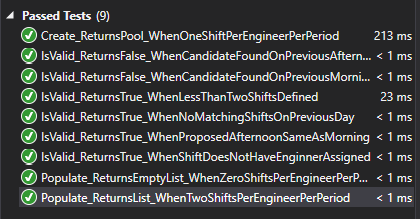

# Support Wheel of Fate - API
A REST API that receives a request and should select two engineers at random to both complete a half day of support each.

##   Deployed Endpoints
-   ( Api ) - http://support-wheel-of-fate-swof.7e14.starter-us-west-2.openshiftapps.com/api/Engineer

- ( Front End ) - https://vinay01joshi.github.io/support-wheel-of-fate/
## Approach
- #### IEngineerPoolFactory
    - Creates a pool, using the number of shifts per engineer per period and figure to determine how many times each engineer is put into the pool

- #### IScheduleGeneratorService
    - Generates a schedule. Due to nature of the Random engineer picking, it sometimes picks the engineers in such a way that there is no valid way to populate all the shifts In this case we just have another go with a new Random object. For example, an engineer may not get picked until the 19th slot which is valid, but then the same engineer cannot be used in the remaining slot.

- #### IEngineerPool
   -  I implement this interface to adds a list of engineers to the pool and Retrieves an engineer from pool at random and Removes the specified engineer from the pool and Resets the list of engineers that can be pulled to the available list of engineers and Gets the number of engineers available abd Gets the number of engineers that have not yet been pulled


## Decision Document
#### Openshift 
- Open shift is docker containerize based hosting environment in which you can deploy any type of code based on container you want .
- Free Open and starter version which include 1GB space and 2 CPU's
- Free MySqL Database instance.

### Github pages
- Github pages are very easy to deploy and make you repository url you fornt end code deployment end point. [click here](https://github.com/vinay01joshi/support-wheel-of-fate/tree/master/SWOF.UI) SWOF.UI deployment document.
  

### .Net Core
- Any Operating system and Light weight framework which support C# with optimized dependency injection framework.

- Any database support with Entity framework core such as i am using mySql

### Angular 4
- Easy Singel page application development with agnular . Component driven framework that make your code more readable and structured. Also the two way binding is an advantage of angular 4.

### Bootstrap 4
- Early release of bootstrap new version is very easy to integrate with any frontend framework which provides more smooth designs.

### App Veyor
- Easy to integrate contineous build and deployment with .net core .

##   Project Structure
- SWOF 
    
    Backend code in asp.net core web api and Entity framework code first with My SQL database.
- SWOF.UI
    
    Front end code with Angular 5
- SWOF.Test

    C# .net core ms test implementation

##   Controllers
### ShiftController
- Create and list engineer turns

### EngineerController
- Manupulates engineer in database.

### ValuesController
- dummy Controller
## Settings
```json
   "Schedule": {
    "ShiftsPerPeriod": 20,
    "ShiftDays": 10,
    "ShiftsPerEngineerPerPeriod": 2
  }
```
## Packages
- Microsoft.EntityFrameworkCore
- MySql.Data
- AutoMapper
## Continuous integrations & Continuous Delivery

#### AppVeyor Build Status

 - [](https://ci.appveyor.com/project/vinay01joshi18498/support-wheel-of-fate/branch/master)

 #### Test Execution
 

#### Deployment
    Openshift containerize build and deployment with asp.net core 2.0 sdk in https://www.openshift.com/

- #### commands
`oc new-app registry.access.redhat.com/dotnet/dotnet-20-rhel7~https://github.com/vinay01joshi/support-wheel-of-fate.git --build-env DOTNET_STARTUP_PROJECT=SWOF`

`oc status`

`oc expose svc/openshift`

`oc get routes`


